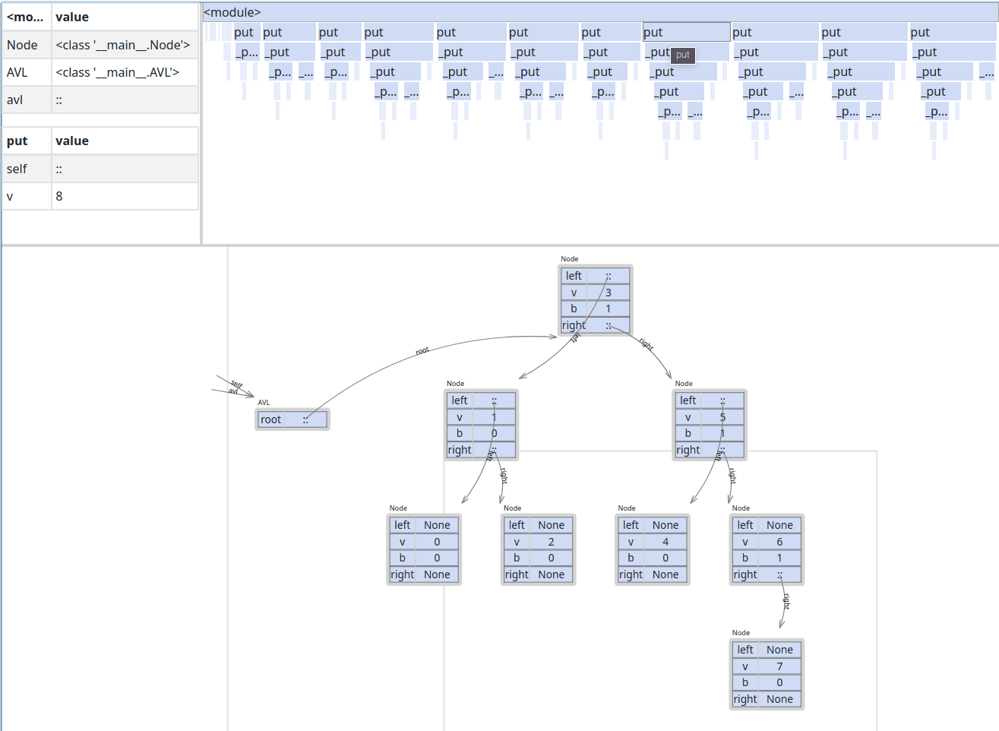
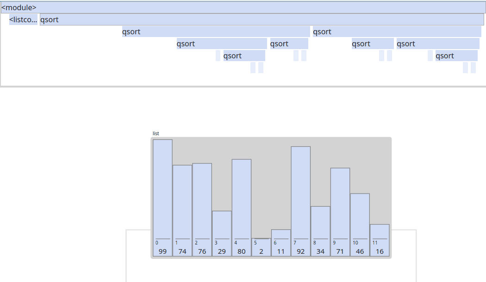

# Willow

Program visualizations for Algorithms and Data Structures.

Demonstration video: https://www.youtube.com/watch?v=y4KFEZGWVtA

## Usage Instructions

[Check usage instructions here](./docs/HOW_TO_USE.md)

## Examples:

Trees:

Sorting:

## Modules Documentation

For more information about willow, check the modules documentations:

-   [API](./api/README.md)
-   [Client](./client/README.md)
-   [Java Tracer](./tracers/java/README.md)
-   [Python Tracer](./tracers/python/README.md)
