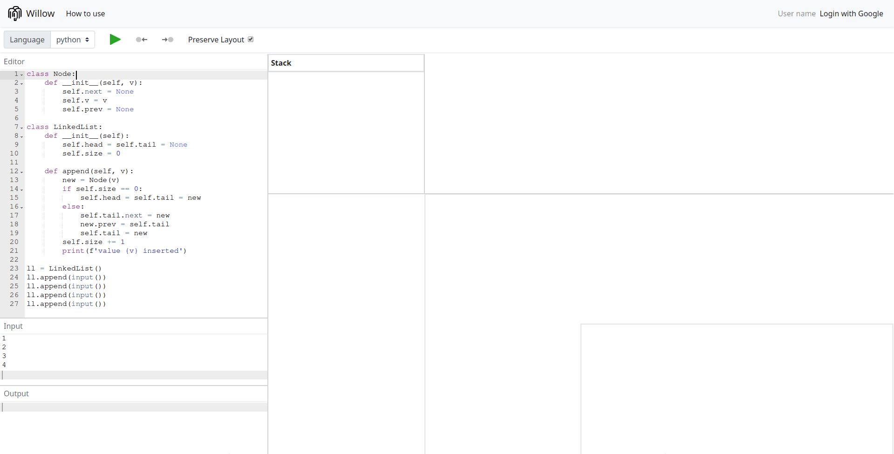
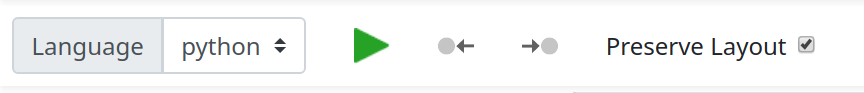
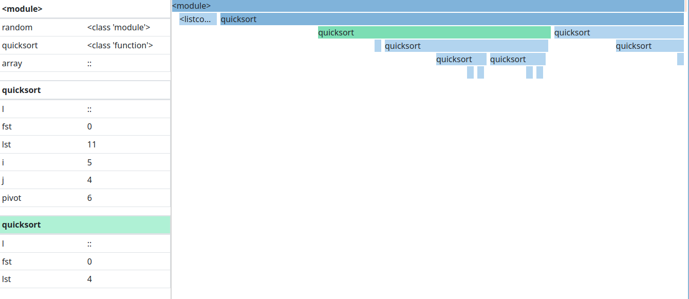
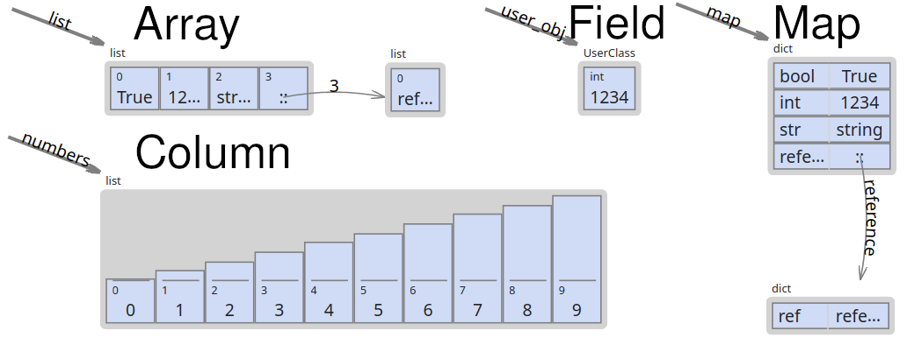
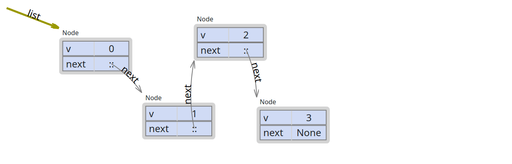
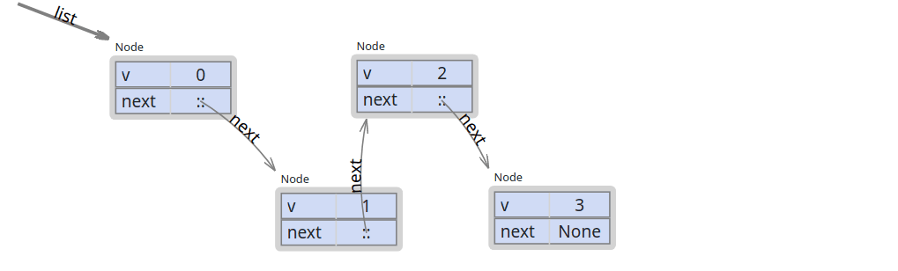
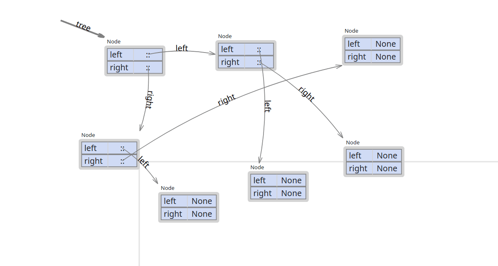
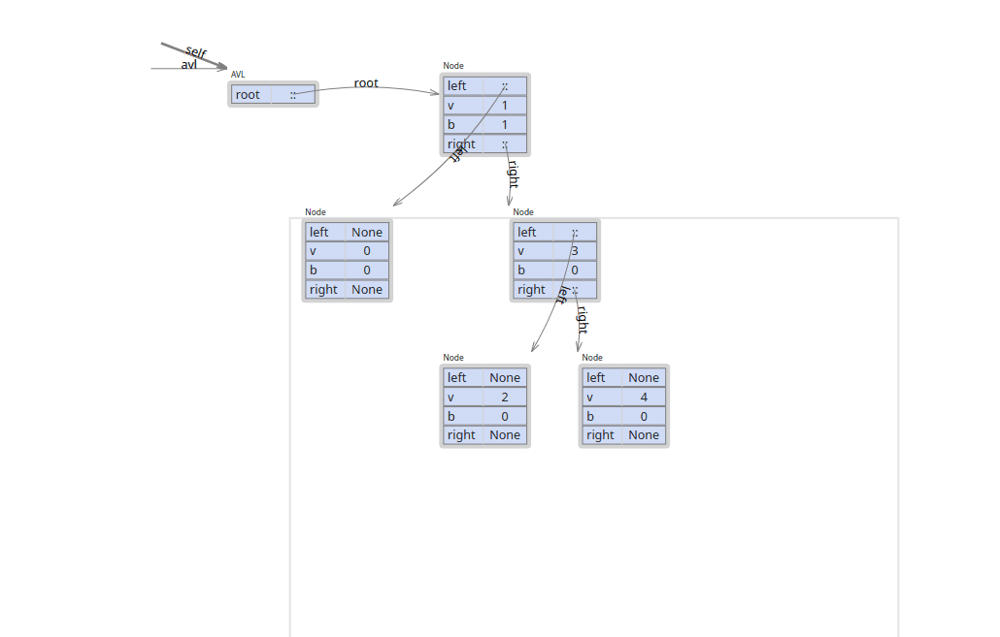
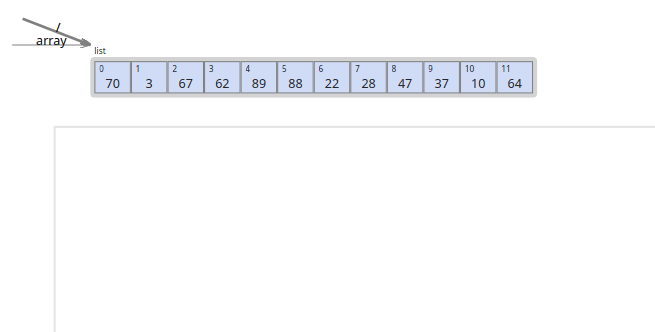

# Instructions on how to use Willow

Willow is a tool for visualizing simple programs which requires minimal user intervention to create better visualizations of algorithms and data structures.

## Interface

The interface is composed by 7 components as shown below, the components can be resized by dragging the borders if needed.

### Toolbar

The toolbar contains the language selection and trace controls.

If more than one **language** is available, the target language shall be chosen in the selector to provide basic editor syntax highlight, and for the right tracer to be chosen.

The **play button** starts the tracing process of the provided source.
The time it takes will depend mostly of the user internet speed, but is usually takes less than 10 seconds.

After the tracing process if the execution fails, the errors will be reported the same way as the language does.
If the program runs successfully, the user will be able to navigate through its steps.
The are some ways to navigate through the program in Willow, one of them is using the **toolbar arrow buttons**, which allow the user to step info backward and forward.

The **Preserve Layout** flag is used to remember manipulations done in a program visualization for the next execution of a program.
It is useful when the user runs consecutive, slightly modified versions of the same program.

### Editors

On the left side there are two editors for source code and input, and an output pane.

The **source editor** provides basic syntax syntax highlight and snippets for the chosen language.
During the execution of the program, it also highlights the next line to be executed.

The **input editor** provides a way to parametrize and test the program without having to hardcode the input in the source code.
The input is sent to the program through the standard input stream.
If the program consumes all available input, it will not hang waiting for more because a EOF flag is also sent. This may cause the program to throw some kind of EOF error.

The **output editor** shows the generated output of the program up to the current execution point of any errors that might have been thrown.

### Visualization components

The visualization components show a representation of the program state.
It is split into Stack and Heap parts.
Note that Stack and Heap are common in most of the programming languages memory layout, but may be used or interpreted differently the the languages.
The user must note that that the components in the visualization are very high level abstractions and do not represent faithfully the elements of the program.

For the sake of the visualization and depending on the language, things that should be represented as objects are not.
In python for example, everything is an object, even things such as numbers and booleans.
Because of this, many elements that should appear as objects are represented as _primitive like_|_structure_ elements in Willow, usually ordinary and some immutable objects (boolean, numbers, strings, types, etc.).
Willow also hides things such as global and builtin variables not to pollute the visualization.

By focusing in any of the visualization components, the user can use left and right keyboard arrows to step forward and backward.

### Stack

The stack shows the variables of all scopes of the program.
Variables that are references to an object in the heap are displayed with the value (`::`) and the reference is shown as an edge in the heap with the variable name.
Some objects may be represented as strings.

When the variable values change from one point of the program to another, they get a yellow highlight.

The **stack trace** shows all functions scopes that were created in the program execution.
Functions on top call the functions below.

The stack trace also shows the current point of the program by darkening the functions scopes called.
The scopes can also be used for program navigation.
By clicking on then, the program step point will jump to the start of the function scope, if the key `ALT` is pressed, it will jump to the end of the function scope.

### Heap

The heap renders most of the objects created during the program execution.
Heap also highlight objects properties that changed the same way as the stack does.
Objects are drawn with default shapes depending on their types, the shapes are:

One shape can be used to render objects that are not their default.
The shapes support:

-   Array: Supports arrays and iterables such as linked lists and sets.
-   Columns: Only supports numeric arrays (without Infinity and NaN).
-   Field: Supports all types of objects.
-   Map: Supports all types of object.

#### Positioning

Objects can be freely moved inside the heap area by dragging them.
Many objects can be moved at once by pressing `ALT` if they are directly or indirectly referenced by parent object.

The effects of the positioning apply for all steps starting from the program step it moved up until a step with a different position applied to the object.

Example:

Given a program with 10 steps, which creates an object X in third step.\
When the user arrives to the third step, The position of X for the program is:

| 1   | 2   | 3\* | 4   | 5   | 6   | 7   | 8   | 9   | 10  |
| --- | --- | --- | --- | --- | --- | --- | --- | --- | --- |
| U   | U   | A   | U   | U   | U   | U   | U   | U   | U   |

-   A -> default position (0, 0)
-   U -> not defined

After stepping from the third to the eighth step, the X undefined positions are set to the default position:

| 1   | 2   | 3   | 4   | 5   | 6   | 7   | 8\* | 9   | 10  |
| --- | --- | --- | --- | --- | --- | --- | --- | --- | --- |
| U   | U   | A   | A   | A   | A   | A   | A   | U   | U   |

-   A -> default position (0, 0)
-   U -> not defined

By moving C, the user sets all positions starting from the current step until the end of the program or a different position:

| 1   | 2   | 3   | 4   | 5   | 6   | 7   | 8\* | 9   | 10  |
| --- | --- | --- | --- | --- | --- | --- | --- | --- | --- |
| U   | U   | A   | A   | A   | A   | A   | B   | B   | B   |

-   A -> default position (0, 0)
-   B -> Final position after first user move
-   U -> not defined

Going back to the step 5 the position of X will be set to A again, if the user moves X again, the position is applied the following way:

| 1   | 2   | 3   | 4   | 5\* | 6   | 7   | 8   | 9   | 10  |
| --- | --- | --- | --- | --- | --- | --- | --- | --- | --- |
| U   | U   | A   | A   | C   | C   | C   | B   | B   | B   |

-   A -> default position (0, 0)
-   B -> Final position after first user move
-   C -> Final position after second user move
-   U -> not defined

Note the the only the A positions are overridden because they are the same position before the user starts moving (undefined positions are also overridden), B positions are different and therefore not overridden. The user can force override by pressing `CTRL` while moving the object. In the example:

| 1   | 2   | 3   | 4   | 5\* | 6   | 7   | 8   | 9   | 10  |
| --- | --- | --- | --- | --- | --- | --- | --- | --- | --- |
| U   | U   | A   | A   | D   | D   | D   | D   | D   | D   |

-   A -> default position (0, 0)
-   B -> Final position after first user move
-   C -> Final position after second user move
-   D -> Final position after third user move (`CTRL` pressed)
-   U -> not defined

#### Automatic Layout

Some simple linked structures such as Linked Lists or Trees can take advantage of the automatic layout feature.
The automatic layout is triggered by the user by double clicking a Node that belongs a data structure.
The layout direction is horizontal by default, pressing `ALT` changes to vertical.

Willow detects data structures by looking for a set of objects of the same type that have references among each other, if the structure has a _container object_ acting as interface, it is ignored.
In this set, Willow looks for a base object (something like the root of a tree or the first node of a linked list) using the depth of the object in the heap.
Based on that, Willow tries to reposition the elements.

User triggered layouts have the same positioning rules, use `CTRL` to enable overriding previous positions.

#### Animation

The different positions of an object can be used to animate it throughout the program execution.
The animation will play automatically when the user changes steps.

#### Context menus

Every object displayed in the Heap has a context menu.
The menu allows the user to change the shape of objects or for groups of objects with the same type.

The context menu's first item is a label that indicates if the shape and parameters changes are applied in the object only or in all objects of the same type.
To change it, click on the label.

-   using own parameters: applies to the object itself only.
-   using type parameters: applies to all objects of same type (default).

It also allows automatic triggering layout when the user steps.
