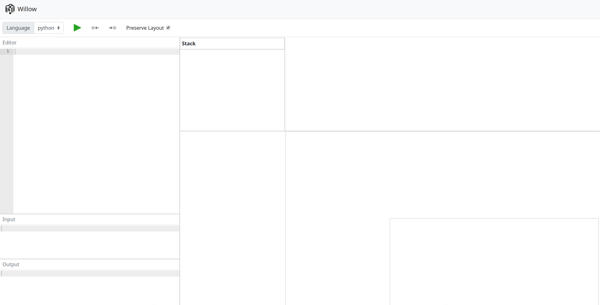

# Instructions on how to use Willow

Willow is a tool for visualizing simple programs which requires minimal user intervention to create better visualizations of algorithms and data structures.

## TL;DR

 TODO

## Interface

The interface is composed by 7 components as shown below, the components can be resized by dragging the borders if necessary.

TODO ? put running example?

### Toolbar

The toolbar contains the language selection and trace controls.

If more than one **language** is available, the target language shall be chosen in the selector to provide basic editor syntax highlight, and for the right tracer to be chosen.

The **play button** starts the tracing process of the provided source.
The time it takes will depend mostly of the user internet speed, but is usually takes less than 10 seconds.

After the tracing process if the execution fails, the errors will be reported the same way as the language does.
If the program runs successfully, the user will be able to navigate through its steps.
The are some ways to navigate through the program in Willow, one of them is using the **toolbar arrow buttons**, which allow the user to step info backward and forward.

The **Preserve Layout** flag is used to remember manipulations done in a program visualization for the next execution of a program.
It is useful when the user runs consecutive, slightly modified versions of the same program.

### Editors

On the left side there are two editors for source code and input, and an output pane.

The **source editor** provides basic syntax syntax highlight and snippets for the chosen language.
During the execution of the program, it also highlights the next line to be executed.

The **input editor** provides a way to parametrize and test the program without having to hardcode the input in the source code.
The input is sent to the program through the standard input stream.
If the program consumes all available input, it will not hang waiting for more because a EOF flag is also sent. This may cause the program to throw some kind of EOF error.

The **output editor** shows the generated output of the program up to the current execution point of any errors that might have been thrown.

### Visualization components

The visualization components show a representation of the program state. 
It is split into Stack and Heap parts.
Note that Stack and Heap are common in most of the programming languages memory layout, but may be used or interpreted differently the the languages.
The user must note that that the components in the visualization are very high level abstractions and do not represent faithfully the elements of the program.

For the sake of the visualization and depending on the language, things that should be represented as objects are not.
In python for example, everything is an object, even things such as numbers and booleans.
Because of this, many elements that should appear as objects are represented as *primitive like*|*structure* elements in Willow, usually ordinary and some immutable objects (boolean, numbers, strings, types, etc.).
Willow also hides things such as global and builtin variables not to pollute the visualization.

### Stack
The stack shows the variables of all scopes of the program.
Variables that are references to an object in the heap are displayed with the value (`::`) and the reference is shown as an edge in the heap with the variable name. Some objects may be represented as strings.

### Heap

#### Positioning, auto-layout and animation

#### Context menus