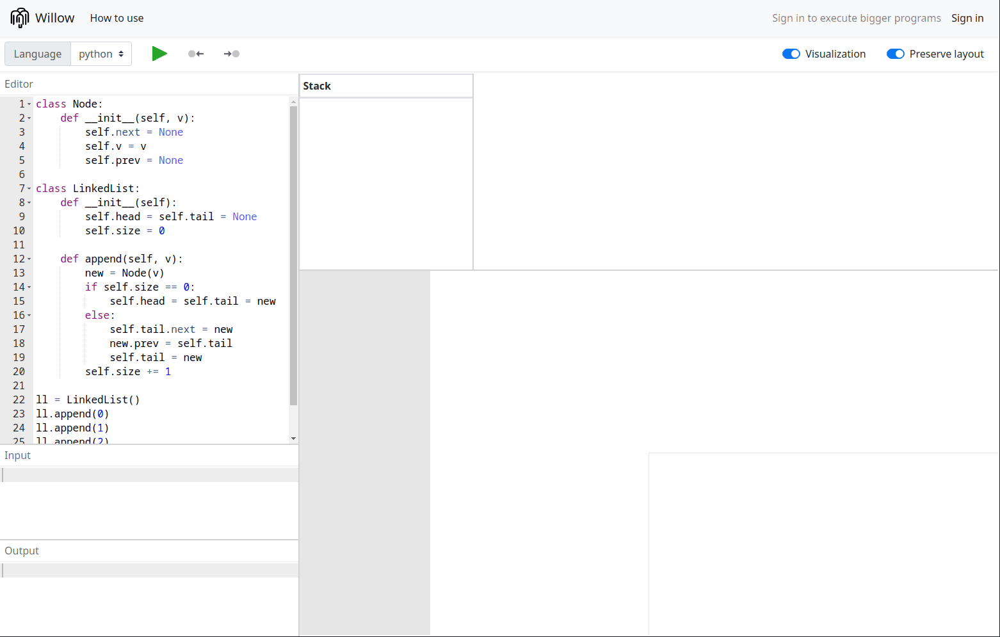
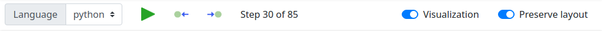
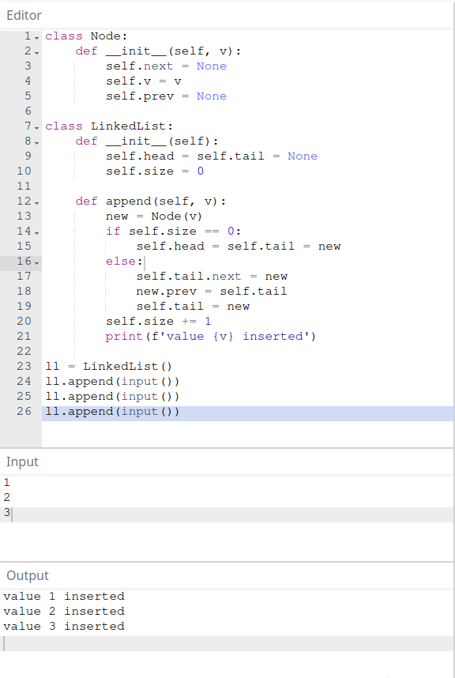
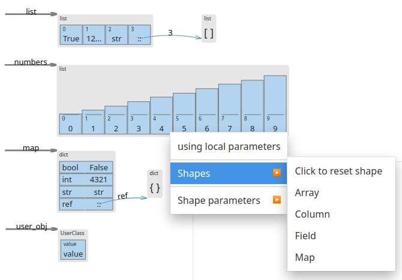
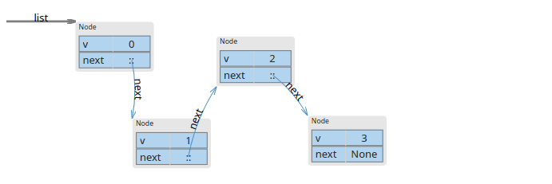
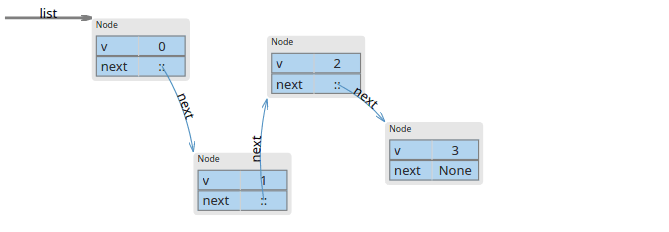

# How to use

## Interface

## Barra de Ferramentas

A brra de ferramenta contém controles de **linguagem** e execução. Escolha um linguagem que queira usar e clique no **play** para começar. As **setas para esquerda e direira** são usadas para nevegar para trás e para frente no código. Você também pode usar as **setas do teclado**.

O switch **Visualization** no lado direito habilita e desabilita os paineis de visualização.
**Preserve Layout** relembra manipulações feitas em uma visualização de programa para as proximas visualizações. Isso é útil se o usuário executar consecutivamente, versões levemente modificadas do mesmo programa.

## Editores

Do lado esquedo há does editores para códifo fonte, entrada, e um painel de saída.

O **editor de código fonte** provê realce básico de sintaxe e snippets para a linguagem ecolhida na barra de ferramentas.
Durante a execução do programa, ele também realça a linha a ser executada, e mostra cores diferentes para chamdas de funções, retornos e exceções.

O **editor de entrada** é usado para alimentar o programa pelo stream de entrada padrão (stdin).
Se o programa consome toda a entrada disponivel, ele não vai parar para esperando por mais entrada, porque uma flag EOF também é emitida.

O **painel de saída** mostra a saída padrão (stdout) do programa até o ponto de execução, ou quaisquer erros que tenham sido lançados.

## Visualização

Os components da visualização mostram a representação do estado do programa.

### Pilha

A pilha mostra as variáveis de todos os escopos do programa.
Variáveis que são referências para um objeto na heap são mostradas com o valor (`::`) e a referência é mostrada como uma flecha na heap com o nome da variável.
Alguns objetos podem ser representados como strings.

### Stack Trace

A stack trace mostra todas os escopos de função que foram criados na execução do programa.
A stack trace também mostra o ponto atual do programa com uma cor de destaque.
Os escopos da stack trace podem também ser usados para navegação no programa.
Ao clicar sobre eles, o ponto de execução do programa saltará para o início do escopo da função, se clicar duas vezes, o salto será para o fim do escopo da função.

### Heap

A heap renderiza os objetos criados durante a execução do programa.
Objetos são desenhados com formas padrão dependendo de esus tipos, mas eles podem ser modificados atravês do menu de contexto.

As formas dispoíveis são:
-   Array: Mostra todos os elmentos de array e iteráveis como listas encadeadas e conjuntos.
-   Columns: Mostra valores como colunas, apenas suporta arrays numéricos (sem infinito e NaN).
-   Field: Mostra um unico campo de um objeto.
-   Map: Mostra todos os campos de um objeto.

Formas tábém tem propriedades extras que mudam o modo com que são desenhadas.

O painel da heap pode ser movido e ampliado ao arrastar e rolar usando o mouse.

> Nota: os componentes da visualização são abstrações de alto nível e não representam fielmente os elemntos do programa.
Pelo bem da visualização e dependendo da lingaugem, elementos que deviriam ser repsentados como objetos aparecem de outras formas, e elmentos builtins podem estar escondidos.

#### Posicionamento.

Objetos podem ser movidos na área da heap ao arrasta-los.
Multiplos objetos podem ser movidos de uma vez ao precionar `ALT` se eles se referenciarem.

Os efeitos do posicionamento se aplicam a partir do passo do programa que o objeto foi movido até o fim do programa.

Disposição automática de estruturas de dados pode ser habilitada ao clicar duas vezes em qualquer elemento da estrutura.
O elmento base apresentará um contorno escurecido, significanto que a disposição automática da estrutura de dados esta ligada.
Se o elemento base é movido ou deletado, a disposição automática é desativada.

